Delivery Driver Customer Analysis
================

Delivery Customer Data of 199 Observations with Data Taken on the Following Variables:

Date | Address | Order Amount | Tip Amount | Age | Time | Tip Included | Dog Owner

=======================================================

``` r
p1 = ggplot(mtcars, aes(mpg, wt, color = cyl)) + geom_point()
ggplotly(p1)
```

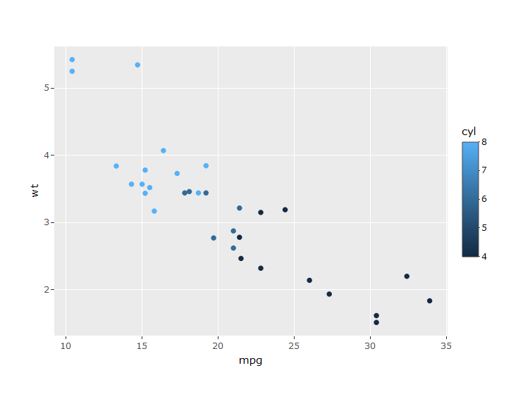

Delivery Map of Tampa, Florida Based on Tip Percentage of Total Order (Tip Percentage)

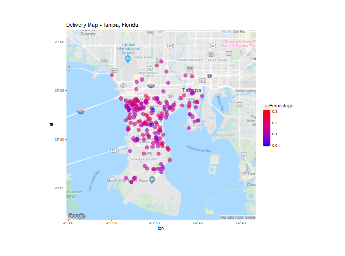

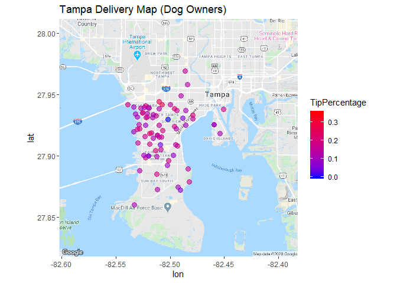

Average Tip Percentage of Dog Owners is 0.1417

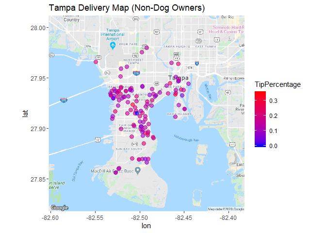 Average Tip Percentage of Non-Dog Owners is 0.1429.

Scatterplot of Tip Percentage of Total Order by Dog Owner

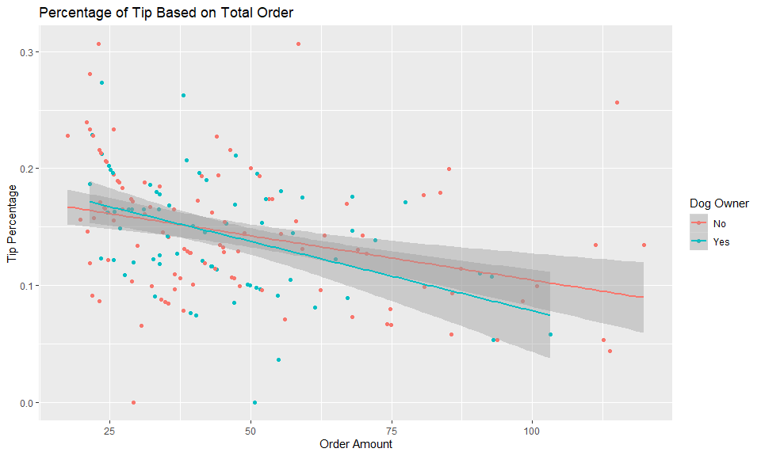

Scatterplot by Gender

Average Tip Percentage of Males is 0.1406

Average Tip Percentage of Females is 0.145

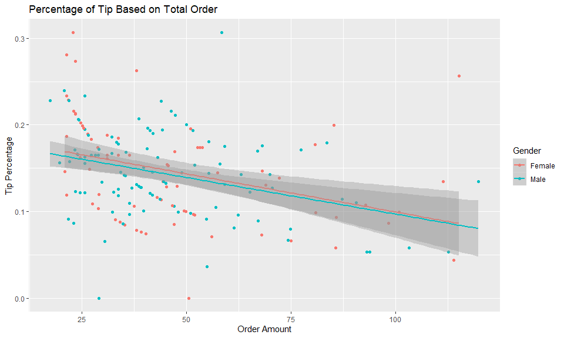

``` r
ggplot(df, aes(df$Age, df$TipPercentage, color = df$Gender)) + 
    geom_jitter(size = 3) + xlab("Age") + ylab("Tip Percentage") + 
    labs(color = "Gender") + ggtitle("Percentage of Tip Based on Age") + 
    geom_smooth(method = "lm")
```

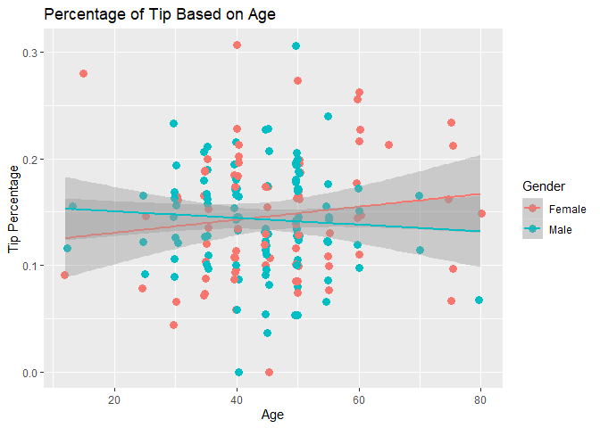

Time Sequence Bar Chart of Orders Placed by Gender

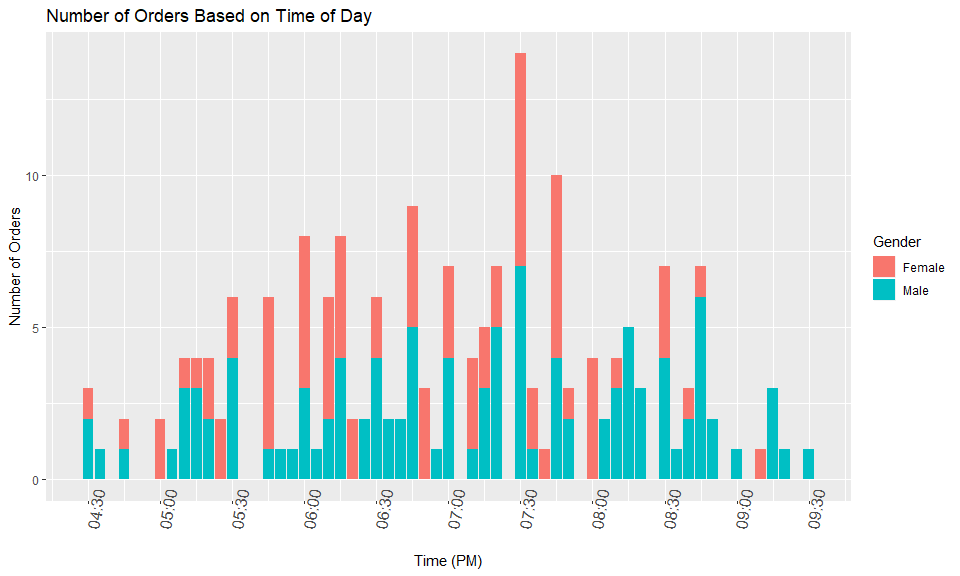

Time Sequence Plots by Dog Owner vs. No Dog Owner

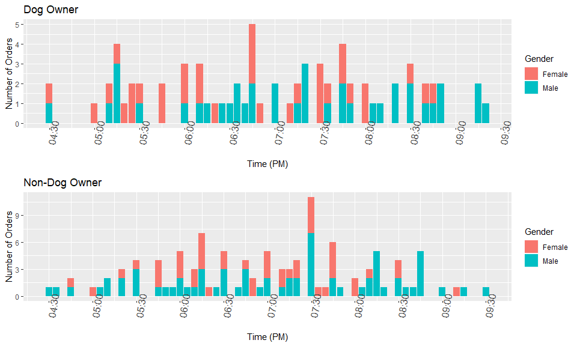


Time Sequence Dot Plot of Orders Placed and Tip Amount ($)

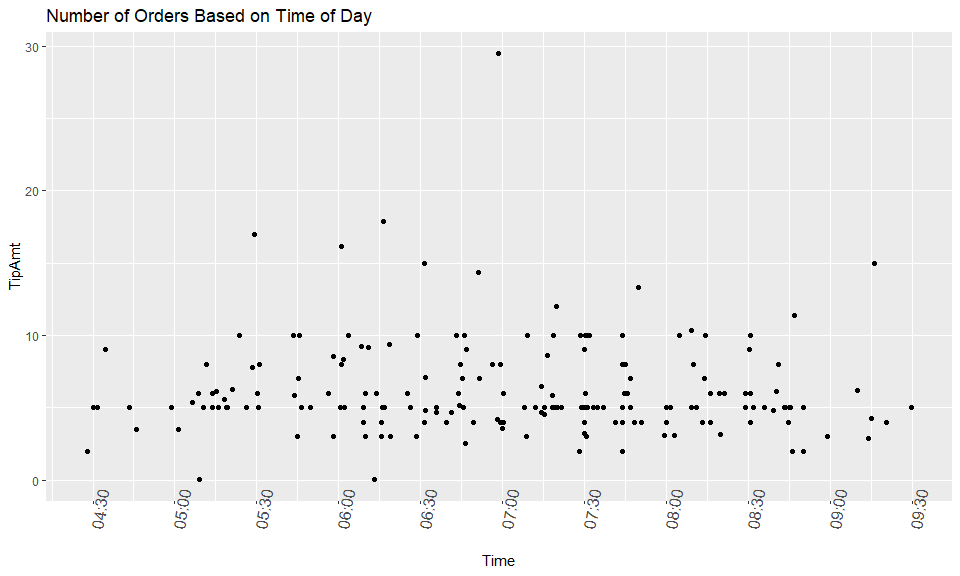

Time Sequence Dot Plot of Orders Placed

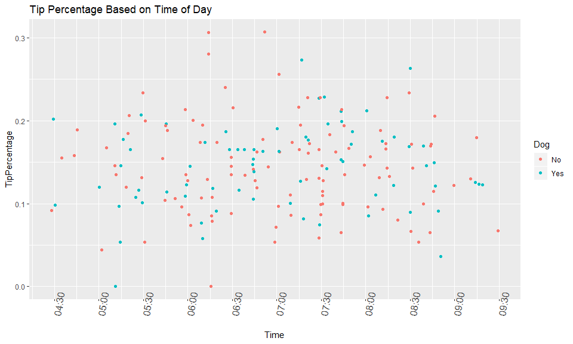

Linear Models

``` r
ggplot(df, aes(df$OrderAmt, df$TipAmt, size = df$Age, fill = Gender)) + 
    geom_point() + geom_smooth(method = lm, show.legend = FALSE) + 
    xlab("Order Amount") + ylab("Tip Amount") + scale_color_gradient(low = "blue", 
    high = "red") + labs(size = "Age", color = "Annual Precipitation")
```


