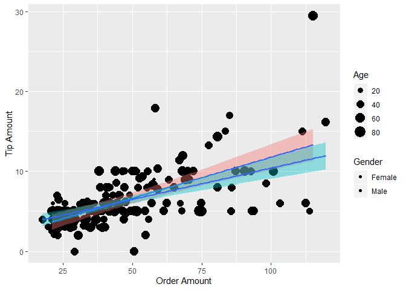

Delivery Driver Customer Analysis
================

Delivery Customer Data of 199 Observations with Data Taken on the Following Variables:


``` r
ggplot(df, aes(df$OrderAmt, df$TipAmt, size = df$Age, fill = Gender)) + 
    geom_point() + geom_smooth(method = lm, show.legend = FALSE) + 
    xlab("Order Amount") + ylab("Tip Amount") + scale_color_gradient(low = "blue", 
    high = "red") + labs(size = "Age", color = "Annual Precipitation")
```


